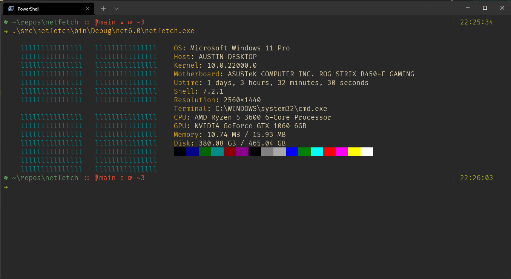

# netfetch
netfetch is a cross-platform system information tool

## Supported platforms
netfetch is written with .NET 6, so I intend to fully support other operating systems

- [X] Windows 11->Vista
- [ ] Linux
  - [ ] Fedora
  - [ ] Ubuntu
  - [ ] Other
- [ ] macOS

